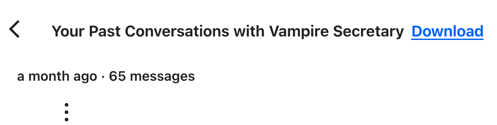
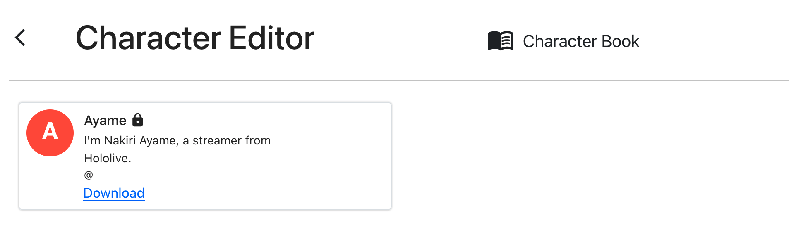

# CharacterAI Dumper Userscript

This userscript allows you to download your saved messages with any bot you've ever talked to, given you can reach their chat history page. If you're a bot creator, it also allows you to separately download your bot's definitions.

## How to use

- Install a userscript manager.
  - Personally I tested this with [Violentmonkey](https://violentmonkey.github.io/get-it/) on Firefox, but I think Greasemonkey and Tampermonkey should work as well.
- Install the userscript [from here](https://github.com/0x000011b/characterai-dumper/raw/master/characterai-dumper.user.js).
- Now, while you're talking to a character, click on "View Saved Chats" to go to their histories page:
  
- After a few seconds, a `Download` link should pop up next to the "Your past conversations with so-and-so" header:
  
- Clicking on the link will download a `.json` file containing the bot's basic info (name, description, greeting) and all the interactions you've ever had with it.
- If you're a bot creator, you can also head over into the Character Editor to download a bot's definitions:
  

## Other notes

- If you've never used the "Save and Start New Chat" feature, you won't have the "View Saved Chats" option shown in the first screenshot.

  - That's fine, it just means you'll need to manually access the histories page by replacing the `/chat` path with `/histories` in the URL. For example, if you're at:

    https://beta.character.ai/chat?char={{BOT_ID_HERE}}

    Just rewrite the URL so it reads:

    https://beta.character.ai/histories?char={{BOT_ID_HERE}}

    And you'll reach the page that should show the `Download` link.

- The script attempts to anonymize the dumped data (it scrubs known sensitive fields and attempts to replace any instances of your name within messages), but if you're paranoid, you should open the downloaded JSON and search for your username/email/display name just to make sure.

## Changelog

- **v1.4:**
  - Fixed a bug where the `Download` link wouldn't show up for a given bot if you had a conversation with it where all of the messages were deleted.
- **v1.3:**
  - Implemented support for downloading a character's definitions from the Character Editor page.
  - Fixed a bug where the `Download` link was not showing up on some bots that had trailing whitespace in their names (e.g. `2B `).
- **v1.2:**
  - Fixed a bug where the user's display name was not being redacted inside messages.
- **v1.1:**
  - File was renamed so userscript managers pick up that it's a userscript and offer to install automatically.
  - If you installed v1.0, you need to manually uninstall and re-install from the new link.
- **v1.0:**
  - Initial release.

## Troubleshooting

If the `Download` link doesn't show up after a few seconds and you're on the proper page, check the DevTools console for errors.

The most probable causes of breakage are:

- You have some browser extension which stopped the userscript from loading its external dependencies properly; or
- CharacterAI changed their API around in ways the script didn't expect, and I'll need to release an update.
